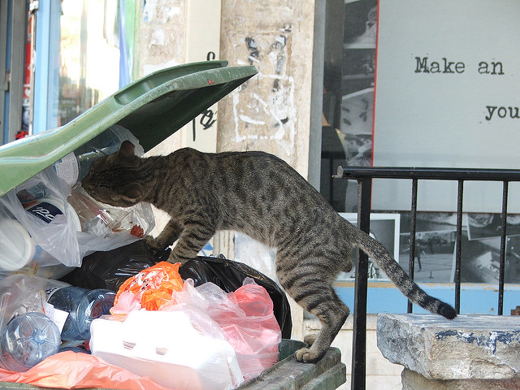

# GreHack'18, CTF and challenges


---

## Why Am I here?

 * GreHack'(15|16|17|18) Organization Committee
 * Software Developer
 * Application Security


---

## GreHack'18

 * [9 talks](https://grehack.fr/2018/program)
 * 8 workshops
 * [Corrupted Memories](https://2018.challenge.grehack.fr/)
 * Capture The Flag
 * ~300 participants


---

## Capture the Flag?

Computer security educational exercise

Goal: Collect as many as possible "evidence of intrusion"

---

## CTF styles

 * Jeopardy
 * Attack/Defense

---

## CTF?

 * Teamwork
 * Technical skills
 * Time limited

---

## CTF?


---

## CTF?


 

---

## GreHack'18 CTF

 * Jeopardy
 * Online before the event ([2018.challenge.grehack.fr](https://2018.challenge.grehack.fr/))
  - 387 players (218 with one validation)
 * Onsite
  - ~200 participants
  - 29 teams
  - 400+ meters of ethernet cables
  - ~30 challenges

---

## What's behind the curtain?

 * Writing (solvable) challenges
 * Infrastructure
  - Hosting challenges
  - Onsite network
  - Internet access

---

## Network


---

## Network


---

## Hosting challenges

**KISS**

 - Virtual machines, emulators and containers
 - (Almost) No orchestration
 - Full disks copy

---

## Challenges


---

## Dumpster Diving - 300 Forensic/Garbage

Or how to be sure players will never come to GreHack again



---

## Dumpster Diving - Write Up
```
0000000000000780 <secret>:
 780:
55                   
push   rbp
 781:
48 89 e5             
mov    rbp,rsp
 784:
48 83 ec 30          
sub    rsp,0x30
 788:
48 89 7d d8          
mov    QWORD PTR [rbp-0x28],rdi
 78c:
48 89 75 d0          
mov    QWORD PTR [rbp-0x30],rsi
 790:
48 8b 45 d8          
mov    rax,QWORD PTR [rbp-0x28]
 794:
48 89 c7             
mov    rdi,rax
 797:
e8 84 fe ff ff       
call   620 <strlen@plt>
 79c:
48 89 45 f0          
mov    QWORD PTR [rbp-0x10],rax
 7a0:
48 8b 45 d0          
mov    rax,QWORD PTR [rbp-0x30]
 7a4:
48 89 c7             
mov    rdi,rax
 7a7:
e8 74 fe ff ff       
call   620 <strlen@plt>
 7ac:
48 89 45 e8          
mov    QWORD PTR [rbp-0x18],rax
 7b0:
48 8b 45 f0          
mov    rax,QWORD PTR [rbp-0x10]
 7b4:
48 83 c0 01          
add    rax,0x1
 7b8:
48 89 c7             
mov    rdi,rax
 7bb:
e8 70 fe ff ff       
call   630 <malloc@plt>
 7c0:
48 89 45 e0          
mov    QWORD PTR [rbp-0x20],rax
 7c4:
c7 45 fc 00 00 00 00 
mov    DWORD PTR [rbp-0x4],0x0
 7cb:
eb 3e                
jmp    80b <secret+0x8b>
 7cd:
8b 45 fc             
mov    eax,DWORD PTR [rbp-0x4]
 7d0:
48 63 d0             
movsxd rdx,eax
 7d3:
48 8b 45 e0          
mov    rax,QWORD PTR [rbp-0x20]
 7d7:
48 8d 0c 02          
lea    rcx,[rdx+rax*1]
 7db:
8b 45 fc             
mov    eax,DWORD PTR [rbp-0x4]
 7de:
48 63 d0             
movsxd rdx,eax
 7e1:
48 8b 45 d8          
mov    rax,QWORD PTR [rbp-0x28]
 7e5:
48 01 d0             
add    rax,rdx
 7e8:
0f b6 30             
movzx  esi,BYTE PTR [rax]
 7eb:
8b 45 fc             
mov    eax,DWORD PTR [rbp-0x4]
 7ee:
48 98                
cdqe   
 7f0:
ba 00 00 00 00       
mov    edx,0x0
 7f5:
48 f7 75 e8          
div    QWORD PTR [rbp-0x18]
 7f9:
48 8b 45 d0          
mov    rax,QWORD PTR [rbp-0x30]
 7fd:
48 01 d0             
add    rax,rdx
 800:
0f b6 00             
movzx  eax,BYTE PTR [rax]
 803:
31 f0                
xor    eax,esi
 805:
88 01                
mov    BYTE PTR [rcx],al
 807:
83 45 fc 01          
add    DWORD PTR [rbp-0x4],0x1
 80b:
8b 45 fc             
mov    eax,DWORD PTR [rbp-0x4]
 80e:
48 98                
cdqe   
 810:
48 3b 45 f0          
cmp    rax,QWORD PTR [rbp-0x10]
 814:
72 b7                
jb     7cd <secret+0x4d>
 816:
48 8b 55 e0          
mov    rdx,QWORD PTR [rbp-0x20]
 81a:
48 8b 45 f0          
mov    rax,QWORD PTR [rbp-0x10]
 81e:
48 01 d0             
add    rax,rdx
 821:
c6 00 00             
mov    BYTE PTR [rax],0x0
 824:
48 8b 45 e0          
mov    rax,QWORD PTR [rbp-0x20]
 828:
c9                   
leave  
 829:
c3                   
ret    
000000000000082a <main>:
 82a:
55                   
push   rbp
 82b:
48 89 e5             
mov    rbp,rsp
 82e:
48 83 ec 30          
sub    rsp,0x30
 832:
89 7d dc             
mov    DWORD PTR [rbp-0x24],edi
 835:
48 89 75 d0          
mov    QWORD PTR [rbp-0x30],rsi
 839:
48 8d 05 d8 00 00 00 
lea    rax,[rip+0xd8]        # 918 
<_IO_stdin_used+0x8>
 840:
48 89 45 f8          
mov    QWORD PTR [rbp-0x8],rax
 844:
48 8d 05 f3 00 00 00 
lea    rax,[rip+0xf3]        # 93e 
<_IO_stdin_used+0x2e>
 84b:
48 89 45 f0          
mov    QWORD PTR [rbp-0x10],rax
 84f:
48 8b 55 f0          
mov    rdx,QWORD PTR [rbp-0x10]
 853:
48 8b 45 f8          
mov    rax,QWORD PTR [rbp-0x8]
 857:
48 89 d6             
mov    rsi,rdx
 85a:
48 89 c7             
mov    rdi,rax
 85d:
e8 1e ff ff ff       
call   780 <secret>
 862:
48 89 45 e8          
mov    QWORD PTR [rbp-0x18],rax
 866:
48 8b 45 e8          
mov    rax,QWORD PTR [rbp-0x18]
 86a:
48 89 c7             
mov    rdi,rax
 86d:
e8 9e fd ff ff       
call   610 <puts@plt>
 872:
48 8b 45 e8          
mov    rax,QWORD PTR [rbp-0x18]
 876:
48 89 c7             
mov    rdi,rax
 879:
e8 82 fd ff ff       
call   600 <free@plt>
 87e:
b8 00 00 00 00       
mov    eax,0x0
 883:
c9                   
leave  
 884:
c3                   
ret    
 885:
66 2e 0f 1f 84 00 00 
nop    WORD PTR cs:[rax+rax*1+0x0]
 88c:
00 00 00 
 88f:
90                   
nop
0000000000000890 <__libc_csu_init>:
 890:
41 57                
push   r15
 892:
41 56                
push   r14
 894:
41 89 ff             
mov    r15d,edi
 897:
41 55                
push   r13
 899:
41 54                
push   r12
 89b:
4c 8d 25 36 05 20 00 
lea    r12,[rip+0x200536]
 8a2:
55                   
push   rbp
 8a3:
48 8d 2d 36 05 20 00 
lea    rbp,[rip+0x200536]
 8aa:
53                   
push   rbx
 8ab:
49 89 f6             
mov    r14,rsi
 8ae:
49 89 d5             
mov    r13,rdx
 8b1:
4c 29 e5             
sub    rbp,r12
 8b4:
48 83 ec 08          
sub    rsp,0x8
 8b8:
48 c1 fd 03          
sar    rbp,0x3
 8bc:
e8 17 fd ff ff       
call   5d8 <_init>
 8c1:
48 85 ed             
test   rbp,rbp
 8c4:
74 20                
je     8e6 <__libc_csu_init+0x56>
 8c6:
31 db                
xor    ebx,ebx
 8c8:
0f 1f 84 00 00 00 00 
nop    DWORD PTR [rax+rax*1+0x0]
 8cf:
00 
 8d0:
4c 89 ea             
mov    rdx,r13
 8d3:
4c 89 f6             
mov    rsi,r14
 8d6:
44 89 ff             
mov    edi,r15d
 8d9:
41 ff 14 dc          
call   QWORD PTR [r12+rbx*8]
 8dd:
48 83 c3 01          
add    rbx,0x1
 8e1:
48 39 dd             
cmp    rbp,rbx
 8e4:
75 ea                
jne    8d0 <__libc_csu_init+0x40>
 8e6:
48 83 c4 08          
add    rsp,0x8
 8ea:
5b                   
pop    rbx
 8eb:
5d                   
pop    rbp
 8ec:
41 5c                
pop    r12
 8ee:
41 5d                
pop    r13
 8f0:
41 5e                
pop    r14
 8f2:
41 5f                
pop    r15
 8f4:
c3                   
ret    
 8f5:
90                   
nop
 8f6:
66 2e 0f 1f 84 00 00 
nop    WORD PTR cs:[rax+rax*1+0x0]
 8fd:
00 00 00 
0000000000000900 <__libc_csu_fini>:
 900:
f3 c3                
repz ret 
Disassembly of section .fini:
0000000000000904 <_fini>:
 904:
48 83 ec 08          
sub    rsp,0x8
 908:
48 83 c4 08          
add    rsp,0x8
 90c:
c3                   
ret    
Disassembly of section .rodata:
0000000000000910 <_IO_stdin_used>:
 910:
01 00                
add    DWORD PTR [rax],eax
 912:
02 00                
add    al,BYTE PTR [rax]
 914:
00 00                
add    BYTE PTR [rax],al
 916:
00 00                
add    BYTE PTR [rax],al
 918:
2a 31                
sub    dh,BYTE PTR [rcx]
 91a:
54                   
push   rsp
 91b:
38 32                
cmp    BYTE PTR [rdx],dh
 91d:
6a 7f                
push   0x7f
 91f:
76 27                
jbe    948 <__GNU_EH_FRAME_HDR>
 921:
2b 0e                
sub    ecx,DWORD PTR [rsi]
 923:
3f                   
(bad)  
 924:
28 3b                
sub    BYTE PTR [rbx],bh
 926:
39 29                
cmp    DWORD PTR [rcx],ebp
 928:
27                   
(bad)  
 929:
21 49 29             
and    DWORD PTR [rcx+0x29],ecx
 92c:
6f                   
outs   dx,DWORD PTR ds:[rsi]
 92d:
3f                   
(bad)  
 92e:
22 3e                
and    bh,BYTE PTR [rsi]
 930:
6d                   
ins    DWORD PTR es:[rdi],dx
 931:
32 49 23             
xor    cl,BYTE PTR [rcx+0x23]
 934:
28 7f 03             
sub    BYTE PTR [rdi+0x3],bh
 937:
3a 3b                
cmp    bh,BYTE PTR [rbx]
 939:
31 41 24             
xor    DWORD PTR [rcx+0x24],eax
 93c:
24 00                
and    al,0x0
 93e:
42                   
rex.X
 93f:
45 20 48 41          
and    BYTE PTR [r8+0x41],r9b
 943:
50                   
push   rax
 944:
50                   
push   rax
 945:
59                   
pop    rcx
...
Disassembly of section .eh_frame_hdr:
0000000000000948 <__GNU_EH_FRAME_HDR>:
 948:
01 1b                
add    DWORD PTR [rbx],ebx
 94a:
03 3b                
add    edi,DWORD PTR [rbx]
 94c:
44 00 00             
add    BYTE PTR [rax],r8b
 94f:
00 07                
add    BYTE PTR [rdi],al
 951:
00 00                
add    BYTE PTR [rax],al
 953:
00 a8 fc ff ff 90    
add    BYTE PTR [rax-0x6f000004],ch
 959:
00 00                
add    BYTE PTR [rax],al
```

---

## Dumpster Diving - Write Up

```c
#include <stdio.h>
#include <stdlib.h>
#include <string.h>

char * secret(char * message, char * key) {
    size_t messagelen = strlen(message);
    size_t keylen = strlen(key);

    char * encrypted = malloc(messagelen+1);

    int i;
    for(i = 0; i < messagelen; i++) {
        encrypted[i] = message[i] ^ key[i % keylen];
    }
    encrypted[messagelen] = '\0';

    return encrypted;
}

int main(int argc, char * argv[]) {
    char * message = "\x2a\x31\x54\x38\x32\x6a\x7f\x76\x27\x2b\x0e\x3f\x28\x3b\x39\x29\x27\x21\x49\x29\x6f\x3f\x22\x3e\x6d\x32\x49\x23\x28\x7f\x03\x3a\x3b\x31\x41\x24\x24";
    char * key = "BE HAPPY";

    char * encrypted = secret(message, key);
    printf("%s\n", encrypted);
    free(encrypted);

    return 0;
}
```

---

## Dumpster Diving - Write Up


---

## Microservices - 350 Web

Let's play!

[gh18web350revival.alpacas.cloud](https://gh18web350revival.alpacas.cloud)

---

## Challenge architecture


---

## SSRF

Server-Side Request Forgery

Abusing a functionality to read and/or update an internal resources 

---

## What does it means in our case?


---

## Motivation

[](https://hackerone.com/reports/341876)

---

## Motivation

[](https://hackerone.com/reports/198690)

---

## Usual countermeasures

 * Proxify all externals requests
 * Software whitelist/blacklist

---

## Back to the challenge

Getting the code

[gh18web350revival.alpacas.cloud/.git/info/refs](https://gh18web350revival.alpacas.cloud/.git/info/refs)

[](https://slashcrypto.org/2018/11/28/eBay-source-code-leak/)

---

## SSRF software protection

```php
use fin1te\SafeCurl\Exception\InvalidURLException;
use fin1te\SafeCurl\Options;
use fin1te\SafeCurl\Url;
use Http\Client\Common\Plugin;
use Http\Client\Exception\RequestException;
use Psr\Http\Message\RequestInterface;

final class SSRFGitPlugin implements Plugin
{
    /**
     * @var Options
     */
    private $options;
    public function __construct()
    {
        $this->options = new Options();
        $this->options->enableSendCredentials(); // Needed for private repositories
    }
    public function handleRequest(RequestInterface $request, callable $next, callable $first)
    {
        if ($request->getUri()->getScheme() !== 'https') {
            $this->options->enablePinDns();
        }
        $uri = $request->getUri();
        try {
            $validated_data = Url::validateUrl((string) $uri, $this->options);
        } catch (InvalidURLException $e) {
            throw new RequestException($e->getMessage(), $request, $e);
        }
        if ($uri->getScheme() !== 'https') {
            $uri = $uri->withHost($validated_data['parts']['ips'][0]);
        }
        return $next($request->withUri($uri));
    }
}
```

---

## SSRF software protection


---

## How it works?

```php
class Url {
    /**
     * Validates the whole URL
     *
     * @param $url     string
     * @param $options fin1te\SafeCurl\Options
     *
     * @return string
     */
    public static function validateUrl($url, Options $options) {
        if (trim($url) == '') {
            throw new InvalidURLException("Provided URL '$url' cannot be empty");
        }
        $parts = parse_url($url);
        // ...
    }
    // ...
    public static function validatePort($port, Options $options) {
        if (!$options->isInList('whitelist', 'port', $port)) {
            throw new InvalidPortException("Provided port '$port' doesn't match whitelisted values: "
                                         . implode(', ', $options->getList('whitelist', 'port')));
        }
        if ($options->isInList('blacklist', 'port', $port)) {
            throw new InvalidPortException("Provided port '$port' matches a blacklisted value");
        }
        //Existing value is fine
        return $port;
    }
    // ...
}
```

---

## Parsing is hard

[](https://www.blackhat.com/docs/us-17/thursday/us-17-Tsai-A-New-Era-Of-SSRF-Exploiting-URL-Parser-In-Trending-Programming-Languages.pdf)

---

## TLDR solution

``http://randomstuff@<internal_ip>:80@example.com``

---

## Questions?

